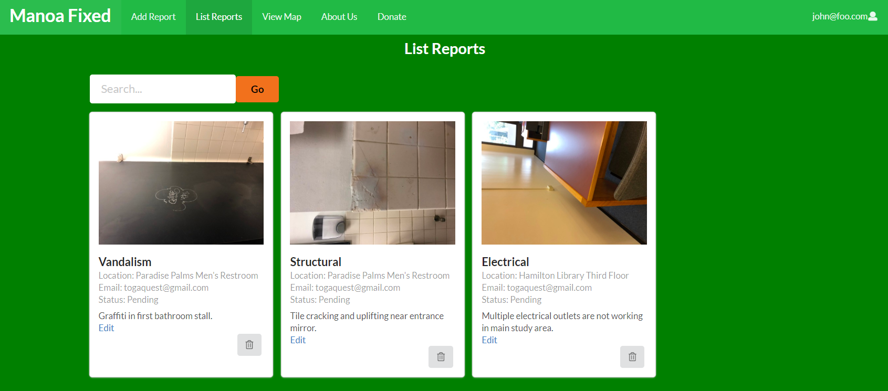
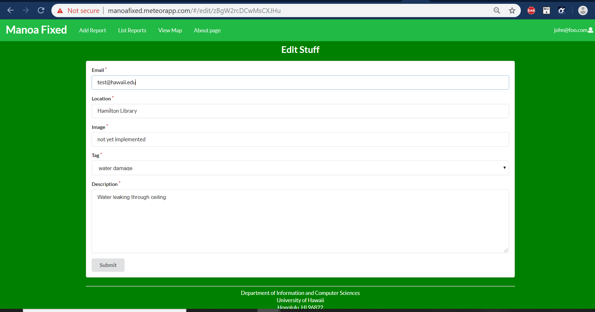

## Table of contents

* [Overview](#overview)
* [Features](#features)
* [User Guide](#user-guide)
* [Developer Guide](#developer-guide)
* [Later Thoughts](#later-thoughts)
* [Milestones](milestones.html)

## REPO & SITE

View the repo [HERE](https://github.com/manoa-fixed)

View the live site on Galaxy [HERE](http://manoafixed.meteorapp.com/#/)

## Overview 

When thinking up an application that could be used to assist UH Manoa in some way, my group thought of a campus repair-related app. We believe that, currently, UH Manoa has no way of organizing or grouping campus repairs into one single source. We are not sure how campus maintenance currently goes about this, but we believe that a webtool or application could greatly help organize their efforts. We will illustrate how this app could be used in practice:

Say a student or faculty member is strolling through campus between classes. This person sees a damaged or suspicious railing, pothole, or something of the like. They use the app to take a photo of the event, and then they write a small caption about the event. Upon upload, the report is also geo-tagged. The app would also have a built-in campus map where dots on the map represent all reports made. If possible, we could implement a feature that does not allow for duplicate reports based on geo-tag similarity. This overall map could be sent to maintenance. Either that, or email notifications could be sent out to maintenance at the time a report is submitted (or even better, both).

Other than Vandalism or Damage reports, the app could also have Lost & Found functionality. I also think we could use the filter() function to filter reports into these three categories. This would organize reports further and allow users to have an easier time finding what report they wish to view.

Lastly, I think we must implement regular users vs administrator roles. An administrator would have the power to remove reports that have been solved or deemed insignificant. I think administrators could be determined by log-in credentials. I think this would be a beneficial project for the campus.

## Features

* Use of email-based password specification for users and adminstrators, and/or use of an alternative authentication mechanism.
* Geo-tagging and mapping.
* Photo with caption uploading. 
* Database tied in to photos and mapping.
* Email notifications
* Categorical grouping

## User Guide

Upon opening the app, a user will see the page with the Add Report button and Sign-In button as available options. If a user attempts to use the Add Report button before signing-in, they will be directed to the sign-in prompt. A sign-in is required because it gives an identity to a submitter, and helps combat against random spammers.

Here is the [Landing Page](http://manoafixed.meteorapp.com/#/) :

Now users can use the Add Report button and be directed to the [Add Report form](http://manoafixed.meteorapp.com/#/add) :

Note the Upload button will allow Drag-&-Drop functionality :

After adding your report, view it in [List Reports](http://manoafixed.meteorapp.com/#/list) :

You may also [edit your report](http://manoafixed.meteorapp.com/#/edit/kcxGBQEmfePWuYG3c) with the following form :

Lastly, before you go, feel free to [donate](http://manoafixed.meteorapp.com/#/donate) to the maintanence department :

## Developer Guide

This tutorial is here for people who would like to download the app, make their own customizations to it, and ultimately run their own version of the app. I will now run through the step-by-step process of how to go about this:

1. First you must install [chocolatey](https://chocolatey.org/install) and [meteor](https://www.meteor.com/install) onto our system.
2. Next, I would recommend installing [Github Desktop](https://desktop.github.com/).
3. Third, download the app's code on [Github](https://github.com/manoa-fixed/manoa-fixed) by clicking on the green Clone button in the upper right area of the screen.
4. Now the last thing you must install is [Node.js](https://www.npmjs.com/get-npm)
5. Oh, almost forgot, you need an IDE! I recommend grabbing [IntelliJ](https://www.jetbrains.com/idea/download/) because that is what I used when making this app.

Once you have these installed, you may proceed with working and running the app itself:

1. Use the `cd` terminal command to move into the `\app` directory. 
2. Once in the proper directory, run the `meteor npm install` prompt to get Meteor working.
3. Feel free to edit the app as you please in an IDE.
4. Once you are satisfied with your edits, run `meteor npm run start`.

You should now see this:

`=> App running at: http://localhost:3000/`
   
Now you should be able to view your app at the given localhost site.

Feel free to play with log-in credentials in the `settings.development.json` file.

If you want to go a step further and have this displayed live on Galaxy like we did, check out this link:

http://courses.ics.hawaii.edu/ics314f19/morea/deployment/experience-test-deployment.html

Once running, you can also change domain names. Look here for more info:

https://galaxy-guide.meteor.com/custom-domains.html

## Milestones

Our milestones are documented on its own page. View them [here](milestones.html).

### Later Thoughts

After letting this idea sit and brew in our heads for a few days, we have realized that it is probably too niche for the entire student/faculty body to utilize. It is unlikely that a majority of students and faculty will take the time to download and use an app with such situational use. Therefore, we propose that this app be tailor made for the maintanence faculty only. Maintanence could use an exclusive webtool that will help organize and document their tasks. If only the maintanence uses this, the app could be more focused and effective for that group of people, without losing any of its overall effectiveness because maintanence are the people mainly looking out for campus damages anyway…. Just my two cents.

