[Back to homepage](index.html)

## Table of contents

* [Milestone 1](#Milestone-1)
* [Milestone 2](#Milestone-2)
* [Milestone 3](#Milestone-3)

## Milestone 1 

See the Project Board here : [M1](https://github.com/manoa-fixed/manoa-fixed/projects/1)

We have three members working on this app: Yuuma, Roman, and Corben. For our first Milestone, we will assign our members individual responsibilities. Each member will specialize in a certain app area. Also for this Milestone, we will start creating rough mock-up webpages to help get a sense of the project.

Member Responsibilites:

* Yuuma : Front-End designer. Codes the visual side of the site. Must have the page look visually appealing. Also can work on implementing categories for the various types of submitted reports.
* Roman : Will incorporate the mapping aspect of the site. Also implement the photo uploading.
* Corben : Back-End engineer. Will manage the database information. Implements Email Notification feature.

Within the first week of starting the project, we managed to get a working landing page. We also managed to get something that we deemed visually satisfying.

Going forward, we still need to get it working database-wise. We will also need to work on the other two tabs because, as of now, they have no connection to the overall goal of the site. This is in part to time constraints, as well as a higher difficulty in implementing them. 

*** UPDATE ***

As of now, we have officially deployed our app to Galaxy. See it [here](http://manoafixed.meteorapp.com/#/).

So far, these are our default pages available to all users. These features are available to users who do not sign-in.
Click on the term to get linked to the site :

[Landing Page](http://manoafixed.meteorapp.com/#/)

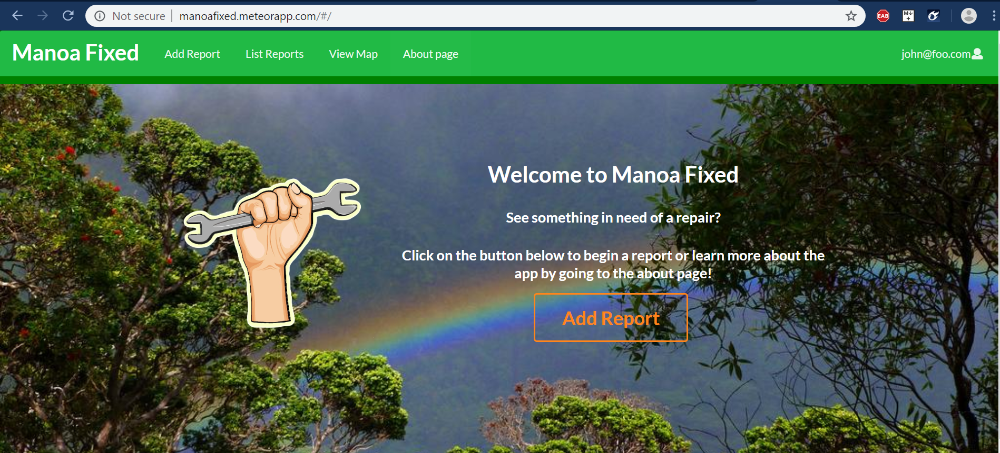

Note that we have added an actual button in addition to the tab. The button is more visually stimulating, and catches a user's eye moreso than the smaller Add tab.

[Add tab](http://manoafixed.meteorapp.com/#/add)

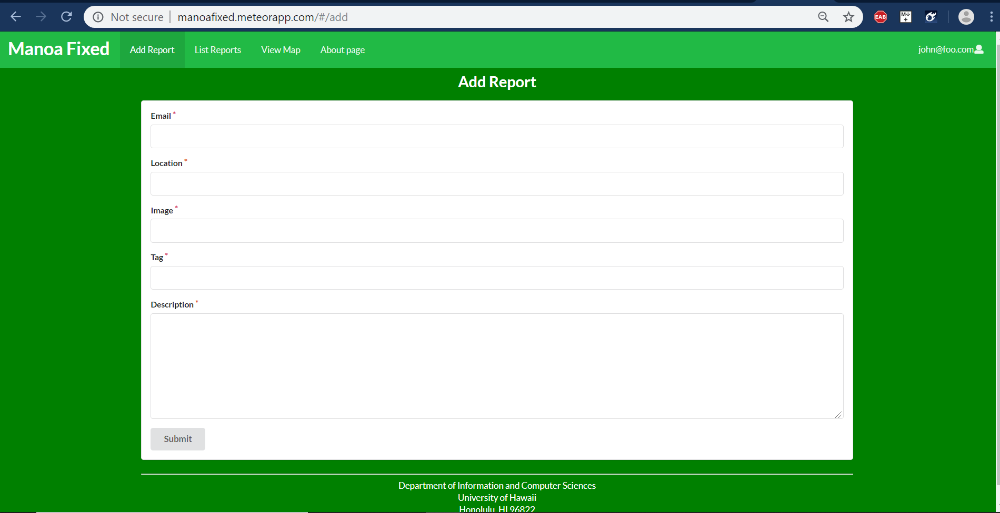

We still need to get the image upload working. Need to also incorporate location coordinates.

[About tab](http://manoafixed.meteorapp.com/#/list)

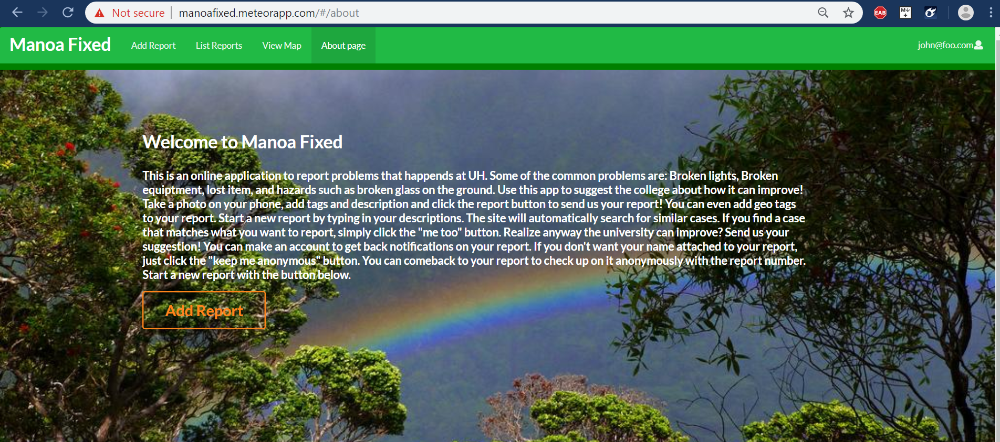

Got the beginnings of the About tab working.

Overall, this was a successful first milestone!

## Milestone 2

See the Project Board here : [M2](https://github.com/manoa-fixed/manoa-fixed/projects/2)

Condensed To-Do List for Milestone 2:

* Add Report : Location and Image should probably not be of type String. May need to change.
* List Report : Edit feature should only be available to admins. 
* View Map : Possibly the hardest feature of the app. Need to break ground on this sooner rather than later.
* Email Notifications : Send out a notification via email to admin account when new report is added.
* Image Upload : Lets try to implement a "Drop Zone" for image upload.

*** UPDATE ***

Now that we are halfway through Milestone 2, I would like to give an update on the our current progress:
So far, I have had success using [Cloudinary](https://cloudinary.com/) to help with image uploads in Add Report. Essentially Cloudinary allows for cloud-based image storage that can be used for websites and apps. So far, it is not completely working, but I have gotten the Drop-Zone feature implemented. To do this, I brought code over from the RadGrad repo, which also uses a Cloudinary widget. Though their code was a good base to work off of, it was also quite difficult to have it working for my site. Since the RadGrad code was written in TypeScript, I had to completely rewire the code for my site's JavaScript needs. At the end of the ordeal, I was satisfied once the "Upload" button was finally working and I could see uploaded images being posted on my Cloudinary account.

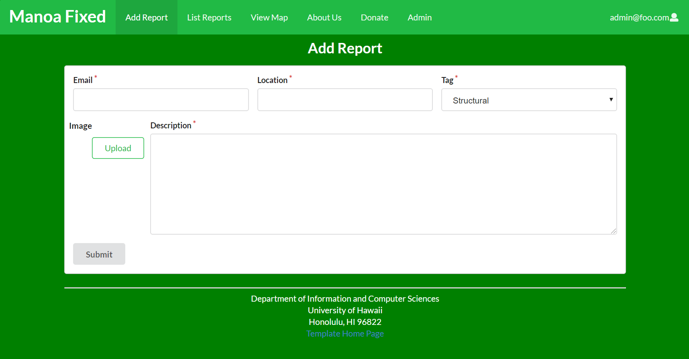

Next, though this was not initially planned, I added a Donate tab to the app. This allows a user to donate to the maintanence department via Paypal, Debit, or Credit to an already made Paypal account. Since I do not know if the maintanence department has an account, I may just change this to donate to our development team. I should mention that I got this code from Paypal's website. I think this was a nice and interesting touch.

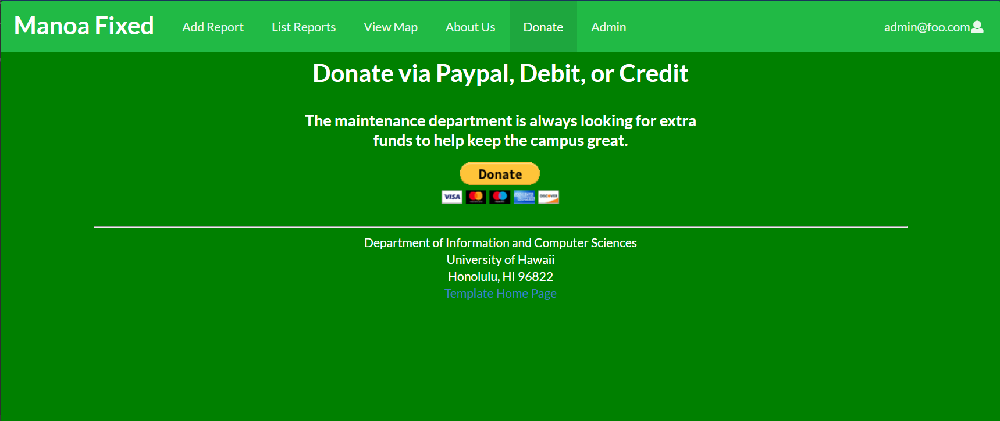

*** UPDATE ***

Managed to finally get the Cloudinary Upload button working. Here is what the new "DropZone" looks like. I am quite pleased with how it turned out.

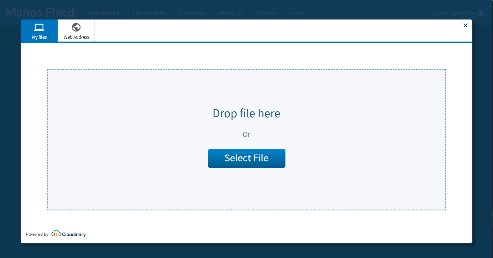

Also, Corben changed some aspects of the Landing Page that he thought would look better. He wanted a different logo. Also he wanted to make the Add Report button filled-in with color so that it would be more eye-catching than the previous transparent one.

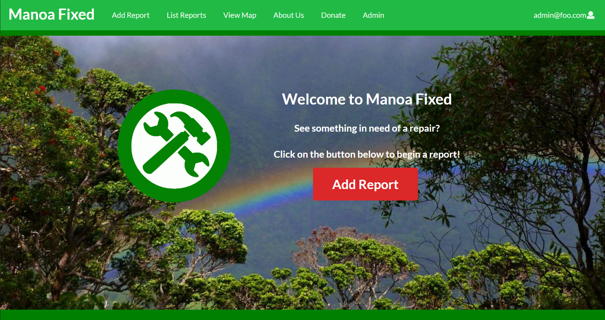

Next, because our image upload is now working, we now can see our List Report cards as they were intended. I also have added a "Status" attribute to the Report Schema. The Status allows for the status of the repair to be labeled. 

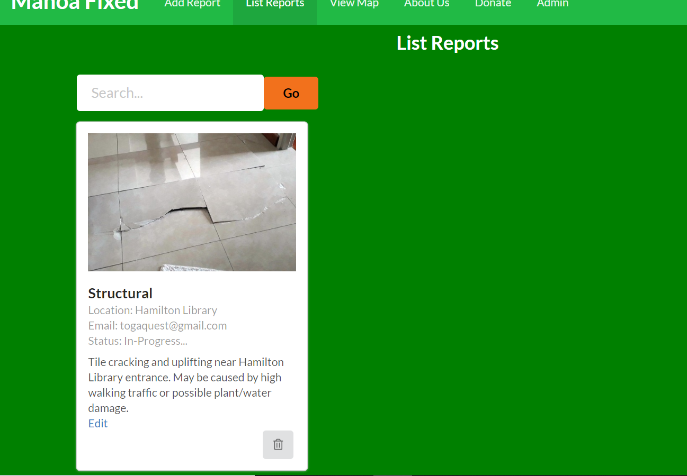

Note on Search-Bar : Implemented by Yuuma, the Search-Bar will likely filter results based on Tagging. Currently it does not have functionality.

I also should mention that we reworked some of the Admin vs General user privileges. All users have the ability to edit their reports. General users can edit all attributes of the Report schema except for Status and Image. The reasoning behind this is that Status can only be upgraded (or possibly downgraded) by an Admin because they are the ones who are likely in communication with the maintenence department. All submitted reports have the default status of "Pending". This is a HiddenText field in Add Report because submissions are likely new submissions (unless in case of a duplicate, which would be removed). As for the reasoning for not allowing Image editing... it is because the Image field is in fact a String. The Image is actually stored as a String URL. This URL is actually a Cloudinary URL that links to my Cloudinary account. It makes sense to not have this displayed. Also, submitting a new URL for a user can be difficult and clunky. However, now that I am thinking of this, possibly instead of having the user directly see the Image String URL, we can put another Cloudinary Upload button similar to the one we have in Add Report inside Edit Report and have that URL overwrite the old one. It is worth a shot for Milestone 3.

Lastly, I want to add a few lessons/tips I have learned during this milestone:
1. Be sure the password in the settings.production.json file matches the password in the online Mongo Database. I was stuck on this for awhile because the Command Prompt does not specify the error during upload. Rather it gives a generic error message that offers no clue to what went wrong during deployment.
2. Turning off your system's Virus Scanner greatly increases the speed during the deployment process. Don't forget to turn it back on afterwards!
3. Deploy the Meteor App locally using `meteor npm run start` before deploying to Galaxy. This is so that you can check small changes without having to display the app publically.

Also, I forgot to mention that Yuuma got the Email Notification feature working. Upon adding a report, an email is sent out to a specified address. Great job!

## Milestone 3

See the Project Board here : [M3](https://github.com/manoa-fixed/manoa-fixed/projects/4)

Condensed To-Do List for Milestone 3:

* Edit Report : Cloudinary Upload Button available for editing Image field in Report Schema.
* Map : Let's attempt to get this map working. If we cannot get it to work, our site is still fine.
* Status Field : We need to color coordinate the Status field in Report Schema.
* Navigation Video : Lets make a video for users showing them how to navigate our site.
* Fix Admin vs General User Issues : Reports between general users and admins are not consistant.

*** UPDATE ***

Notice !: We have decided not to implement the map feature within the milestones of this project. This is due to a combinations of time constraints (exams and projects for other classes) and the priorities of other apsects of the project. Also, ideally we would want to render a map of the UHM campus, however we do not have one currently and it would likely be difficult to make. It would not work with only a Google Map generation because we need to have the actual buildings in view, ideally not in the way that Google Maps displays them. A custom map would need to be made and we simply do not have the time to do this. However, in the future if we can come back to the project it would definitely be something to look into. I found this link to be a good resource :

https://meteorcapture.com/how-to-create-a-reactive-google-map/

I liked that link because it gives instructions on how to make a reactive map where users drag-and-drop a pin onto the map.  

Onto actual work :
Corben has officially rewired the Cloudinary Button into Edit Report. Something that I think can be improved is that we need to get the image that is already in the database to be auto-submitted if the user chooses not to upload a new one. Currently it requires a user to re-upload an image. I feel like in most cases a user would not want a new image to upload. Most edits are likely for minute adjustments to the verbal fields, having to upload an image everytime would quickly become an annoyance.

Also, I put the location, date, status, and owner (submitter) fields into a "View Attributes" pop-up. I thought this looked cleaner. Also the status tag is now color-coordinated.

Another big update we did was change the tag attribute so that it is implemented as actual tagging. Previously, you could only select one value, now you can select multiple. This changed tag in the schema from going from a type of String to a type of Array of Strings. This will work later on down-the-line and go hand-in-hand with the search bar filter. We also added a "title" field were a user can enter a title to their report. I would like to implement a limit to the amount of characters a user can input into the title field (also location field for that matter). 

Something else I added was a default value to the Image field in schema. This is so that a user does not have to submit an image in their new report if they do not want to. This is because there may be situations in which a person sees something that could be reported, but they may not have a camera on them at that moment. The default value now is a URL to an image in my Cloudinary. Also, there is some reasoning as to why it is a Cloudinary URL and not just the URL of the image found in "the wild" (Google Search). I moved it into my Cloudinary because there is a chance that the image on Google Search could potentially be deleted, which could cause a bug during upload on the actual site.

Here is the default image :

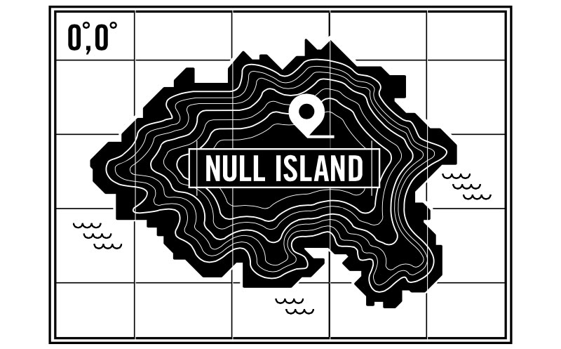

Also I added Lorem Ipsum text to the default value of the Description field in the Reports Schema.

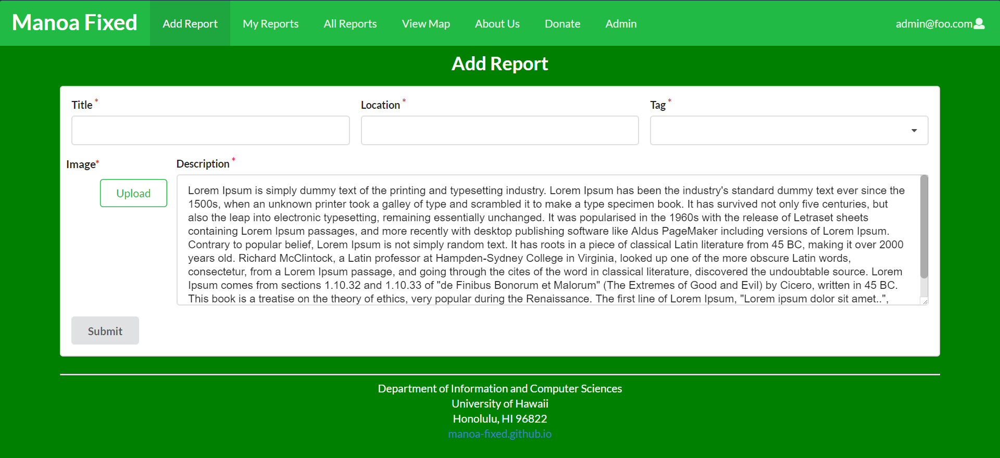

However it has since been removed due to majority group opinion.

*** UPDATE ***

Some bugs I have found in the site :
* Admins edit status is working for reports they as admins have created, however when trying to edit status for a report a general user has created, it says :

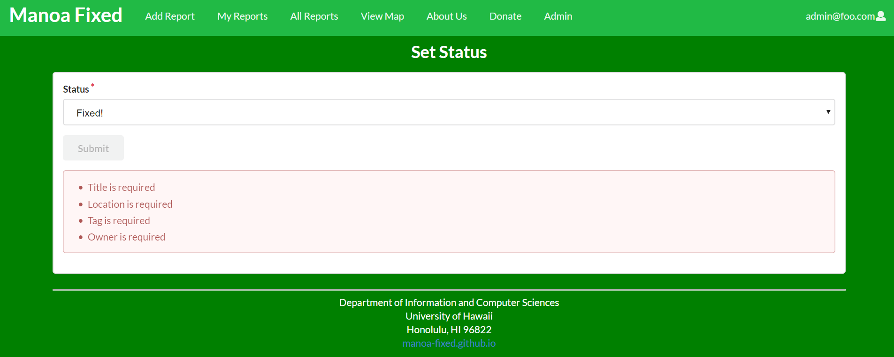

The fix? It was something very simple that we looked over. We were simply subscribing to the wrong publication. We needed to subscribe to "ReportsAdmin", not what we had which was just "Reports."

Also we have cleaned up other aspects of our site. We also got the Search feature working (it filters by tagging).

We are proud to say that we have completed this project!

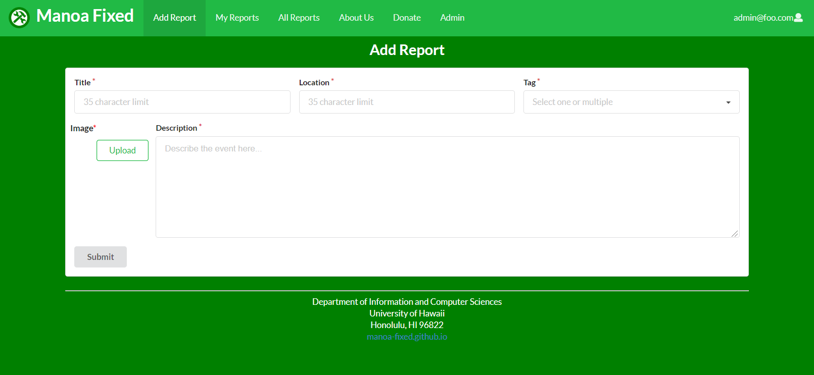

Some things I have learned during this milestone :
1. Use `meteor reset` to reset the Meteor database locally. Is there an equivalent to reset the database on Galaxy? 
  ANSWER: Professor Johnson provided instructions to do this here: http://courses.ics.hawaii.edu/ics314f19/morea/meteor-2/reading-meteor-refresh-database.html
  
  Links to Galaxy and MongoDB:
  
    [galaxy](https://galaxy.meteor.com/ics314f19)
    [mongodb atlas](https://cloud.mongodb.com/v2/5dd32b1ba6f239c7a3dca386?csrfTime=1576480008083&csrfToken=fc3c45eb706b1df7cdb1f0c3516a8c229745881d&currentOrgId=5dd32b1af2a30bcce8c0dab4&email=rnicolai%40hawaii.edu&needsMfa=false&uId=5dd32b16553855184bda795f#clusters)
    
2. Always clear the Galaxy database when changing the schema. This is because old fields may not connect to new fields, causing problems.
