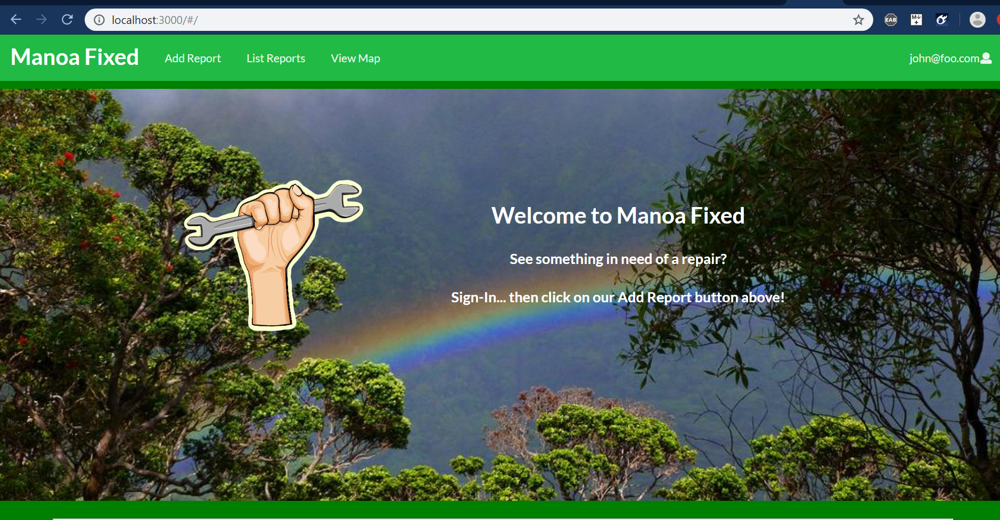
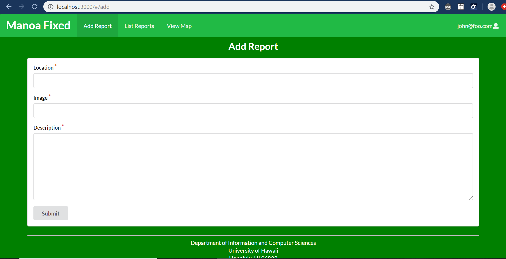

[Back to homepage](index.html)

## Table of contents

* [Milestone 1](#Milestone-1)

## Milestone 1 

See the Project Board here : [M1](https://github.com/orgs/manoa-fixed/projects/3)

We have three members working on this app: Yuuma, Roman, and Corben. For our first Milestone, we will assign our members individual responsibilities. Each member will specialize in a certain app area. Also for this Milestone, we will start creating rough mock-up webpages to help get a sense of the project.

Member Responsibilites:

* Yuuma : Front-End designer. Codes the visual side of the site. Must have the page look visually appealing. Also can work on implementing categories for the various types of submitted reports.
* Roman : Will incorporate the mapping aspect of the site. Also implement the photo uploading.
* Corben : Back-End engineer. Will manage the database information. Implements Email Notification feature.

Within the first week of starting the project, we managed to get a working landing page. We also managed to get something that we deemed visually satisfying.

Next, we designed the beginnings of our Add Report tab.

Going forward, we still need to get it working database-wise. We will also need to work on the other two tabs because, as of now, they have no connection to the overall goal of the site. This is in part to time constraints, as well as a higher difficulty in implementing them. 

Condensed To-Do List for Milestone 2:

* Add Report : Location and Image should probably not be of type String. May need to change.
* List Report : Need to change default info. Where does that info come from (what file)? Edit feature should only be available to admins. 
* View Map : Possibly the hardest feature of the app. Need to break ground on this sooner rather than later.

Overall, this was a successful first week and milestone!

## Milestone 2

See the Project Board here : [M1](https://github.com/orgs/manoa-fixed/projects/4)

As of now, we have officially deployed our app to Galaxy. 

